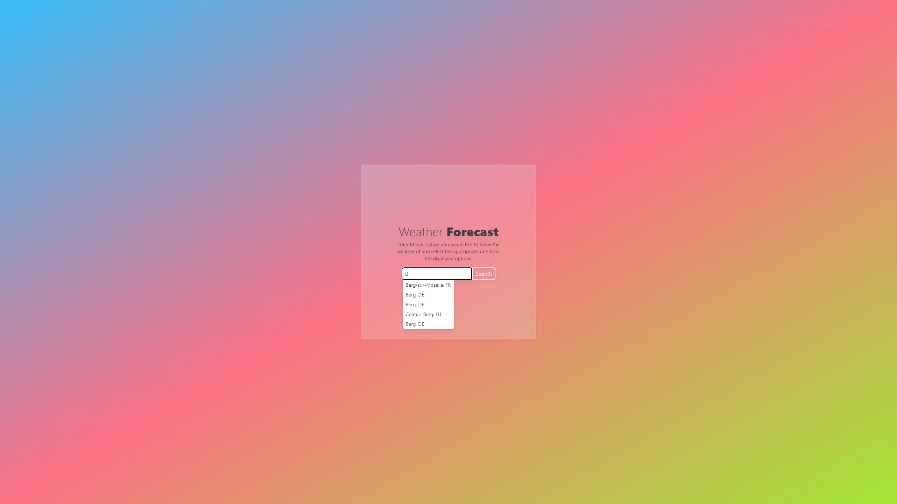
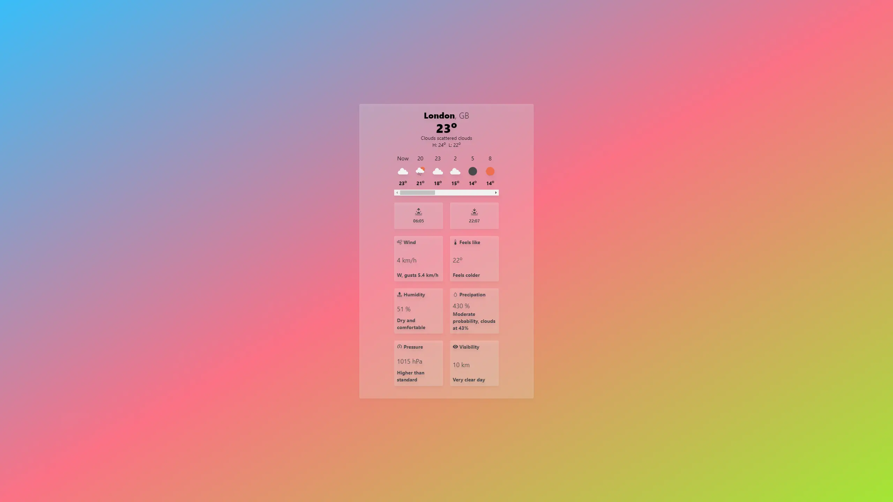

<br/>
<div align="center">
  <a href="">
    
  </a>

  <h1 align="center">Weather App</h1>

  <p align="center">
    <a href="https://weather-app-react-ts-rf.netlify.app/" target="_blank"><strong>Live Website »</strong></a>
    <br/>
    <br/>
  </p>
</div>

<details>
  <summary>Table of Contents</summary>
  <ol>
    <li>
      <a href="#about-project">About Project</a>
    </li>
    <li>
      <a href="#screenshots">Screenshots</a>
    </li>
    <li><a href="#tech-stack">Tech Stack</a></li>
    <li>
      <a href="#installation">Installation</a>
    </li>
  </ol>
</details>
 <br />

## About Project

Weather App website built using React JS, TypeScript and designed using Tailwind CSS. Website is based on fetching data from Weather API. It allows users to search for any city, selecting one from those suggested by a dynamically generated list. The application then displays detailed weather data for the selected location.

## Screenshots




## Tech Stack

- 
- 
- 
- Axios

## Installation

To get started with this project, simply clone the repository:

```bash
git clone https://github.com/Vertori/wthr-app-react-typescript.git
```

To setup API, go to [Open Weather API Website](https://openweathermap.org/api) and create an account.<br/>
Click 'My API Keys' and copy your API Key<br/>
Create .env file in root folder<br/>
Paste your API Key to your .env file as shown below

```bash
VITE_API_KEY = 'Your API Key'
```

Use the package manager [npm](https://www.npmjs.com/) to install the dependencies.

```bash
npm install
```

After that, run the following command to start the development server:

```bash
npm run dev
```
